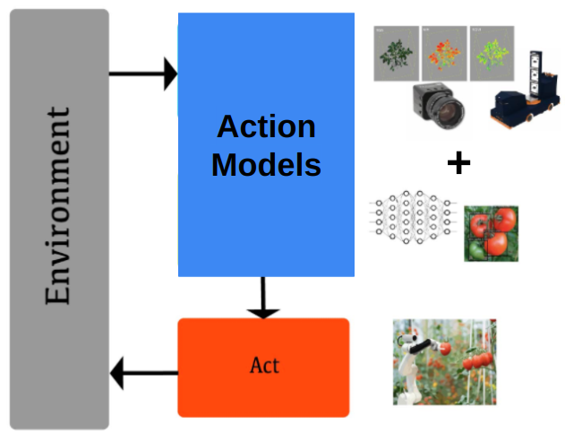
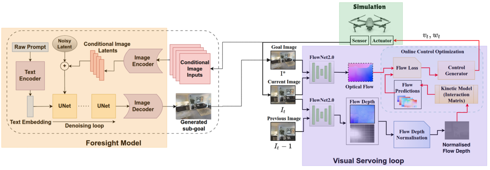
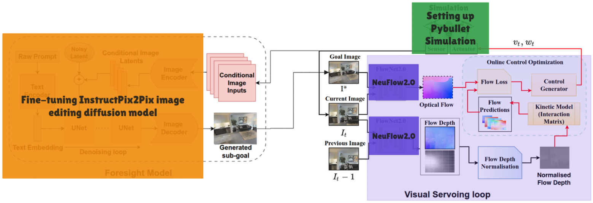

# Intelligent Visual Servoing with Diffusion Models

### Contributors
  - Mohamed Magdy Atta
  - Shahid Ahamed hasib
  - Metheus Pedrosa
  - Mohamed Alsisi
## Overview

It was known for a long time in the robotics field that autonomous robotic systems follows a three-steps architecture that separate the perception, planning, and control during execution. Such traditional architectures usually require a predefined goal location or image and depend on a considerable number of sensors for feedback making them limited in adaptability and scalability. For instance, in a lot of real-world scenarios, robots need to perform tasks in environments where the final goal state is unknown at deployment, or where the robot must interpret high-level instructions rather than simply matching a reference location or image. These constraints hinder the deployment of robots in unseen and dynamic environments.

With the rise of the new deep learning models recently, a new robotic architecture called action models was introduced to overcome the mentioned limitations by leveraging recent advances in generative models, specifically the diffusion-based image editing models. The new aarchitecture merges both perception and planning into a single step to enable robots to perform long-range navigation and manipulation tasks starting from arbitrary initial states without the need for predefined goal locations or images and with a minimal sensor suite, such as a single camera mounted on the robot base or end-effector. This is done by synthesizing intermediate goal images from high-level language prompts and current sensory observations. Overcoming such limitations was the motivation behind choosing that 2-step framework. The specific pipeline choice is [Imagine2Servo](https://arxiv.org/abs/2410.12432) which focuses on performing Visual Servoing intelligently with diffusion-driven goal generation for robotic tasks.

<div align="center">

<p>The Robotic system 2-step architecture
</p>
</div>

## Imagine2Servo Architecture

Imagine2Servo paper deals with the task of generating the next subgoal for the servoing controller as editing the pixels of the current input image. Given the current image and task description P, authors aim to generate the subgoal image using the foresight diffusion model. They employ RTVS (Real-Time Visual Servoing) as the Image-Based Visual Servoing (IBVS) controller to reach the subgoals predicted by the foresight module. They use the RTVS servoing algorithm without any fine-tuning to the newer environments.

<div align="center">

<p>Imagine2Servo architecture
</p>
</div>

The Foresight Model serves as the generative part of the framework, producing sub-goal images that guide the robot to complete high-level tasks specified by language prompts. The process begins with a raw text prompt, such as "reach the red ball" which is transformed into a dense semantic embedding by a text encoder. This embedding, combined with a noisy latent vector and conditional image latents representing the robot’s current observation, forms the input to a denoising diffusion process implemented via the U-Net architecture. The U-Net iteratively refines the noisy latent to generate a sub-goal image. Finally, an image decoder translates the refined latent into an actual image, representing the next intermediate state the robot should achieve to complete its the task. The authors used Instructpix2pix image editing framework in this step.

The Visual servoing loop converts the generated sub-goal image into actionable control commands. This loop receives the sub-goal (goal image), the robot’s current camera observation, and the previous image as inputs. Using FlowNet2.0, it estimates the optical flow between the goal and current images, determining the pixel-wise motion required to move toward the sub-goal. 

## Implementation & Key Contributions

In the implementation of the Imagine2Servo framework, we began by designing the simulation setup using PyBullet simulator, where a Franka Emika Panda 7-DOF manipulator equipped with a single eye-in-hand camera was used to perform a range of reaching tasks. To support robust training and evaluation, we generated a comprehensive dataset consisting of variations of reaching tasks such as “reach the red ball” and “reach the blue box” with each variation containing a number of demonstrations and five camera frames recorded per demonstration as ground truth sub goals with randomized initial frames to ensure diversity. A key contribution in our pipeline was the replacement of the traditional FlowNet2 optical flow network with NeuFlow2, a more performant model on edge devices, to improve the accuracy and stability of visual servoing in the RTVS loop. Implementation of the diffusion-driven goal generation pipeline, as described in the original paper, was done. This pipeline removes the dependency on predefined goal images and allows for more adaptive and language-driven robotic behavior. We fine-tuned the InstructPix2Pix diffusion model on our custom dataset, focusing on single-view camera input to mimic realistic robotic perception scenarios. The entire system is fully integrated, including simulation, diffusion model, and a closed-loop visual servoing loop, resulting in a reproducible and extensible architecture.

<div align="center">

<p>Imagine2Servo architecture
</p>
</div>

## Results

<p align="center">
  <table>
    <tr>
      <td align="center">
        <br/>
        <sub>Reaching red ball task - Test 1</sub>
      </td>
      <td align="center">
        <br/>
        <sub>Reaching red ball task - Test 2</sub>
      </td>
      <td align="center">
        <br/>
        <sub>Reaching red ball task - Test 3</sub>
      </td>
    </tr>
  </table>
</p>


## Qualitative Evaluation Results

Across 20 qualitative test trials, the model exhibited a range of behaviors in response to the given prompts. As shown in Table 1, the agent successfully reached the intended object in 11 out of 20 trials, demonstrating the model's core capability to interpret and act on instructions accurately. In 4 trials, the agent reached the correct object, but the model altered the shape or color of surrounding objects, indicating partial success with some visual inconsistencies. In the remaining 5 trials, the model generated a new or unintended object, reflecting a failure mode where hallucinated elements appeared in the scene.

These results suggest that, while the model often performs the intended action, it struggles with maintaining scene consistency and avoiding the creation of extraneous objects. To address these limitations, it is recommended to increase the number of frames used during training (for example, from 5 to 10 frames) and to expose the model to a broader variety of scenarios. This approach is expected to improve both the temporal understanding and generalization ability of the model.

### Table 1: Summary of Qualitative Trials

| Outcome                                                | Number of Trials (out of 20) |
|--------------------------------------------------------|------------------------------|
| Correctly reached the object                           | 11                           |
| Reached object, but changed shape/color of surroundings| 4                            |
| Created a new/unintended object                        | 5                            |


## How to Use

1. Clone the repository:
    ```
    git clone https://github.com/mohamedmajdi/Intelligent-Visual-Servoing.git
    cd Intelligent-Visual-Servoing
    ```

2. Create a conda environment & install the dependencies:
    ```
    conda create --name ivs --file requirements.txt
    conda activate ivs
    ```

3. Install [NeuFlow_v2](https://github.com/neufieldrobotics/NeuFlow_v2.git) in the pipeline simulation folder:

4. If you encounter NeuFlow import errors like in `from NeuFlow import something`, change it to `from . import something`
  
5. If you get GPU memory errors after stopping the simulator with `Ctrl+C`, kill the leftover process:
      ```
      nvidia-smi
      ```
      - Find the process ID (PID) and run:
      ```
      kill <PID>
      ```

6. Run pipeline simulation and test models using two files `pipeline simulation/Imagine2Servo_run_rtvs.py` and `pipeline simulation/Imagine2Servo_run_rtvs_4Objects.py`

7. To test the trained diffusion model separately, use `Inference.ipynb` . The notebook contain links to the trained models in hugging face. The model that is trained for one task can be found [here](https://huggingface.co/shahidhasib586/instruct-pix2pix-model). The model that is trained for four tasks can be found [here](https://huggingface.co/Shahidhasib1014/instruct-pix2pix-custom). A number of our generated datasets that can be used to train and test the model can be found using this [link](https://drive.google.com/drive/folders/1o0uUVZ5c_OA3Kmk4iKR_xySU-Fy-7sgj?usp=sharing)

8. For fine-tuning your own model:
    - **Data collection**:
      `Data Collection/IBVS_panda_arm_data_collection.py`
    - **(Optional) Shuffle the dataset**:
      `Data Collection/shuffle_jason_file.py`
    - **Fine-tune the diffusion model**:
      `Diffusion Fine Tuning/train_instruct_pix2pix.py`      
      > The script is adapted to accept the dataset format generated using `Data Collection/IBVS_panda_arm_data_collection.py` . For reference on how to fine tune the model, see the [original Hugging Face training process](https://github.com/huggingface/diffusers/tree/main/examples/instruct_pix2pix).
